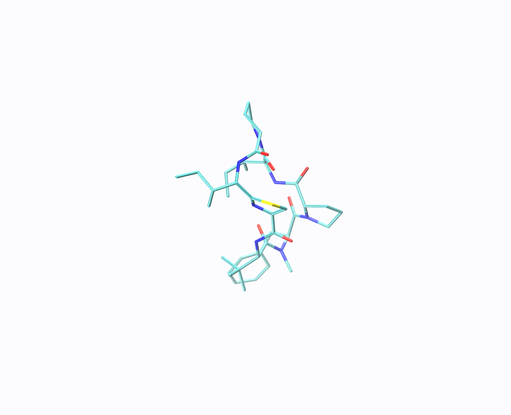

# AGDIFF_chi

AGDIFF_chi is an all-atom diffusion workflow for molecular 3D structure generation with stereochemistry-aware conformer filtering. This repository contains the AGDIFF codebase plus a cyclic-peptide/small-molecule generation entry point that was used for the stereogenic implementation described in the JCIM paper below.

**Paper:** [Accurate 3D Structure Prediction of Small Cyclic Peptides Containing Non-Canonical Amino Acid Residues Using an All-Atom Diffusion Model with Stereogenic Implementation](https://pubs.acs.org/doi/abs/10.1021/acs.jcim.5c03236), *Journal of Chemical Information and Modeling*, 2026.

<p align="center">
  
</p>

## What is included

- `scripts/smiles_generation.py` — SMILES-to-SDF generation script.
- `logs/cremp_default_batch64_2024_12_12__14_42_15/best_model/best_model.pt` — bundled pretrained checkpoint used for the AGDIFF_chi code test.
- `logs/cremp_default_batch64_2024_12_12__14_42_15/cremp_default_batch64.yml` — paired configuration file loaded with the checkpoint.
- `assets/diffusion.gif` — molecule-generation animation.
- `agdiff.yml` — Conda environment file for a public AGDIFF_chi installation.
- `setup.py` / `pyproject.toml` — editable-install metadata inherited from the original AGDIFF package layout.

## Robust stereochemistry filtering

The `scripts/smiles_generation.py` workflow includes robust post-generation filtering for molecules with specified stereocenters:

1. Compare only the chiral centers that are explicitly specified in the input SMILES.
2. Ignore newly assigned R/S labels at originally unspecified centers.
3. If every originally specified chiral center is reversed, treat the conformer as a global mirror image, reflect its coordinates, re-detect 3D chirality, and keep it only if the reflected conformer matches the target stereochemistry.
4. Apply a simple covalent bond-length QC before accepting a conformer.
5. Stop early once the requested number of filtered conformers has been obtained.
6. Write the final filtered output as `molecules.sdf` in the requested output directory.

Accepted conformers are annotated in the SDF with properties such as:

- `agdiff_source_index`
- `agdiff_filter_reason`
- `agdiff_bond_min`
- `agdiff_bond_max`

Common filter reasons include:

- `specified_centers_match`
- `all_specified_centers_reversed_flipped_to_match`
- `no_assigned_chiral_centers_flippable`

## Environment setup

The recommended setup follows the original AGDIFF installation pattern: create a Conda environment, install PyTorch/PyG packages matched to your CUDA build, then install this repository in editable mode.

### 1. Create the Conda environment

```bash
conda env create -f agdiff.yml
conda activate agdiff
```

The provided `agdiff.yml` targets Python 3.10 with PyTorch 2.4.x and CUDA 12.1. It includes the common scientific dependencies used by AGDIFF/AGDIFF_chi, including RDKit, NumPy, SciPy, pandas, scikit-learn, PyYAML, EasyDict, tqdm, TensorBoard, NetworkX, and Joblib.

If your workstation uses a different CUDA version, adjust the PyTorch/PyG commands below according to the official PyTorch and PyTorch Geometric installation pages.

### 2. Install PyTorch Geometric compiled extensions

For the CUDA 12.1 / PyTorch 2.4 environment above, install the PyG packages with the matching wheel index:

```bash
pip install torch_geometric==2.6.1
pip install torch-scatter==2.1.2 -f https://data.pyg.org/whl/torch-2.4.0+cu121.html
pip install torch-sparse==0.6.18 -f https://data.pyg.org/whl/torch-2.4.0+cu121.html
pip install torch-cluster==1.6.3 -f https://data.pyg.org/whl/torch-2.4.0+cu121.html
```

### 3. Install AGDIFF_chi in editable mode

From the repository root:

```bash
pip install -e .
```

### 4. Verify the installation

```bash
python - <<'PY'
import torch
import torch_geometric
import torch_scatter
import torch_sparse
import torch_cluster
import rdkit

print('torch', torch.__version__)
print('torch_geometric', torch_geometric.__version__)
print('torch_scatter', torch_scatter.__version__)
print('torch_sparse', torch_sparse.__version__)
print('torch_cluster', torch_cluster.__version__)
print('rdkit', rdkit.__version__)
print('cuda_available', torch.cuda.is_available())
PY
```

For GPU generation, `cuda_available` should be `True`.

## Generate conformers from a SMILES string

Example: generate five filtered conformers for cyclo(Ala-Ala-Ala-Ala-Ala).

```bash
CKPT=logs/cremp_default_batch64_2024_12_12__14_42_15/best_model/best_model.pt
SMILES='C[C@@H]1NC(=O)[C@H](C)NC(=O)[C@H](C)NC(=O)[C@H](C)NC(=O)[C@H](C)NC1=O'

python scripts/smiles_generation.py "$CKPT" \
  --smiles "$SMILES" \
  --out_sdf outputs/cyclo_AAAAA \
  --num_confs 1 \
  --num_refs 5 \
  --max_num_refs 50 \
  --gpus 1 \
  --n_steps 5000 \
  --tag cyclo_AAAAA_demo
```

The filtered result is written to:

```text
outputs/cyclo_AAAAA/molecules.sdf
```

## Output interpretation

During generation, the script may oversample because stereochemical filtering can reject many raw candidates. For example, in a five-conformer cyclo(Ala)5 test, the script generated 98 raw conformers in two chunks of 49 raw conformers each, then early-stopped after five conformers passed stereochemistry and bond-length QC.

Use RDKit to count accepted records:

```bash
python - <<'PY'
from rdkit import Chem
path = 'outputs/cyclo_AAAAA/molecules.sdf'
print(sum(1 for m in Chem.SDMolSupplier(path, removeHs=False) if m is not None))
PY
```

## Original AGDIFF usage

Training and benchmark evaluation scripts from the base AGDIFF implementation are kept in this repository. Example training commands:

```bash
python scripts/train.py ./configs/qm9_default.yml
python scripts/train.py ./configs/drugs_default.yml
```

Example benchmark generation command:

```bash
python scripts/test.py ./logs/path/to/checkpoints/${iter}.pt ./configs/qm9_default.yml \
  --start_idx 0 --end_idx 200
```

## Citation

If you use AGDIFF_chi, please cite:

```bibtex
@article{wu2026agdiffchi,
  title   = {Accurate 3D Structure Prediction of Small Cyclic Peptides Containing Non-Canonical Amino Acid Residues Using an All-Atom Diffusion Model with Stereogenic Implementation},
  author  = {Wu, Dizhou and Zou, Yike},
  journal = {Journal of Chemical Information and Modeling},
  year    = {2026},
  doi     = {10.1021/acs.jcim.5c03236}
}
```

This repository builds on the original AGDIFF implementation:

```bibtex
@misc{wyzykowskiAGDIFFAttentionEnhancedDiffusion2024,
  title         = {{{AGDIFF}}: {{Attention-Enhanced Diffusion}} for {{Molecular Geometry Prediction}}},
  author        = {Wyzykowski, Andr{\'e} Brasil Vieira and Fathi Niazi, Fatemeh and Dickson, Alex},
  year          = {2024},
  month         = oct,
  publisher     = {ChemRxiv},
  doi           = {10.26434/chemrxiv-2024-wrvr4},
  archiveprefix = {ChemRxiv}
}
```

## Acknowledgement

AGDIFF_chi is based on AGDIFF, GEODIFF, PyTorch, PyTorch Geometric, and SchNet. We thank the developers and contributors of these projects for making their work available.
